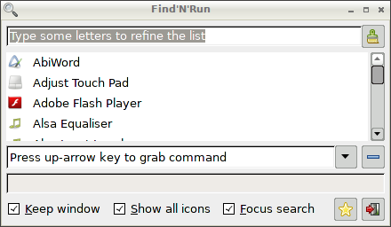
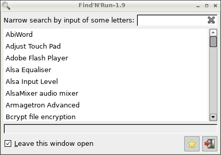
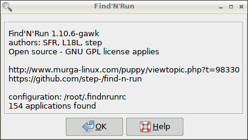

# find-n-run

Enhanced version of the _original_ Find'N'Run linux utility.

[Project home](http://github.com/step-/find-n-run)

As of version 1.10.5 this script is featured in the _original_
[Find'N'Run](http://www.murga-linux.com/puppy/viewtopic.php?t=98330),
so you need not worry which one you are getting.

## Introduction

Puppy linux users SFR and L18L created the _original_ Find'N'Run, an
application starter script that displays your `*.desktop` files in a
`gtkdialog` window with a progressive typing search field to refine the
hit list.

This project takes the shell script further, by increasing search
speed, adding many new features, documentation and translations.

This version does not include the optional ROX-Filer application directory
found in the _original_ version.

Unlike the _original_ script, this version uses GNU `awk` (gawk) for
core operations.

### Naming

 - _find-n-run_ refers to this new project and its repository.
 - _Find'N'Run_ refers to the _original_ project. For historical reasons both projects also used it as the window title.
 - `findnrun` is the script name; the same _name_ for both projects - but of course the script contents differ.

## Overview

New features:

 * **Faster searching**.
   It is also possible to search through **application
   comments** and **categories**, searching for **left-starting matches** only,
   searching using **regular expressions**, and enforcing **case-dependence**.
 * **Application icon** column. [1]
 * **Command line entry** with command history.
   A combobox widget
   tracks the command associated with the currently selected `.desktop`
   item. Pressing up-arrow/down-arrow moves back/forward in the history
   of previously executed commands. [2]
 * **Keyboard focus** control.
   After starting an application focus can be returned to
   either the search input field or to the selected application list item.
 * **Geometry** support to exactly size and position the main window.
 * **New hi-res desktop icon**. 
 * **Full localization support**.
 * **Extensive tooltips**, and new configurable **user preferences**.

**Notes**

[1] It can happen that some icons unexpectedly look empty.
   Enable option _"Show all icons"_ in the main window to fix the look.

[2] Due to limitations of the `gtkdialog` comboboxentry widget, the
   combobox is normally blank until it is focused **and** up-arrow has
   been pressed at least once. The first key press displays the
   command associated with the current entry.

## Screenshots

Side by side: Left: version 1.10.6-gawk (default window size) -- Right: original version 1.9 (Fatdog64-701).

## Installing

It is recommended to install the latest full package for your distribution.
The package includes a help file, a desktop icon and file, and traslations.
However, if you prefer a barebone, manual installation you can just copy
the script file `usr/bin/findnrun`.

This version can replace directly the `findnrun` script included with
Fatdog64-700, a 64-bit OS in the Puppy linux family, and the script
included in the `.pet` package for all other Puppies. For older .pet versions
simply replace the existing file `/usr/local/apps/FindNRun/findnrun` with
file `/usr/bin/findnrun` from this repository.

## User Preferences

The user preferences file is created as `~/.findnrunrc` on first run.

Users can specify an alternative preferences file from the shell command line:

    env CONFIG="/my/findnrun/conf" /usr/bin/findnrun

### Gui Preferences

These values can be set also from the main window:

    # Keep the main window open after starting an item.
    defOPEN=false
    # Show and cache all application icons.
    varICONS=false
    # Return keyboard focus to the search input field.
    varFOCUSSEARCH=true

### Hidden Preferences

These values are hidden in the main window. They are intended mostly for power users and custom applications:

    # Icon cache location.
    ICONCACHE=${HOME}/.icons
    # Extend search to application comments (OR).
    SEARCHCOMMENTS=false
    # Extend search to application categories (OR).
    # Prepend ';' to search for category only, i.e., ';office'.
    SEARCHCATEGORIES=false
    # Search pattern must match from the leftmost character.
    # Ignored for category search.
    SEARCHFROMLEFT=false
    # Search pattern is a POSIX Basic regular expression.
    # Applied also to comment search and category search.
    SEARCHREGEX=false
    # Enforce case-dependent searching.
    CASEDEPENDENT=false
    # Main window geometry, no default.
    # Command-line option --geometry=WxH+X+Y overrides this value.
    #GEOMETRY=460x280+100+200
    # Desktop file search directories, space-separated list, system default.
    #DESKTOP_FILE_DIRS=~/.local/applications /usr/share/applications /usr/local/share/applications
    # Icon search directories, space-separated list, system default.
    #ICON_DIRS=~/.icons ~/.local/іcons /usr/share/icons /usr/local/share/icons /usr/share/pixmaps /usr/share/midi-icons /usr/share/mini-icons

## Command-line options

`--geometry=WxH+X+Y`

  Set window Width`x`Heigth and top-left corner position.
  You may omit `WxH` or `+X+Y`.

## Known issues and limitations

 * Freedesktop.org's
   [icon theme](http://standards.freedesktop.org/icon-theme-spec)
   support isn't implemented. This means that if multiple
   icon themes are installed _findnrun_ will apply the first icon found
   in alphabetical order.
   You can work around this limitation by setting hidden user preference
   `ICON_DIRS`.

## Reporting bugs

Please file bugs against this script in the issues section of the
[github repository](https://github.com/step-/find-n-run/issues)
_and not in the Puppy Linux forum thread_. You do not need a github accont
to file new issues.

## Translations

If the system locale is correctly configured, `findnrun` should automatically
display entry _name_ and _comments_ in the local language provided that the
corresponding `.desktop` file includes translation strings.
Note that entry _categories_ are available in English only accoding to the
freedesktop.org's desktop file specifications
[ref1](http://standards.freedesktop.org/desktop-entry-spec/latest/ar01s04.html)
and
[ref2](http://standards.freedesktop.org/desktop-entry-spec/latest/ar01s05.html).

I will gladly add contributed translations to the git repository if
translators send them to me. Generate a Github pull request or attach your
contributed files to the above-mentioned forum thread.
See [TRANSLATING](TRANSLATING.md) for further instructions.

## Credits

[CREDITS](CREDITS.md)

## Change Log

See the project [release announcements](https://github.com/step-/find-n-run/releases) page and - for fine-grained information - the [commit history](https://github.com/step-/find-n-run/commits/master) page.

## License

[LICENSE](LICENSE)

